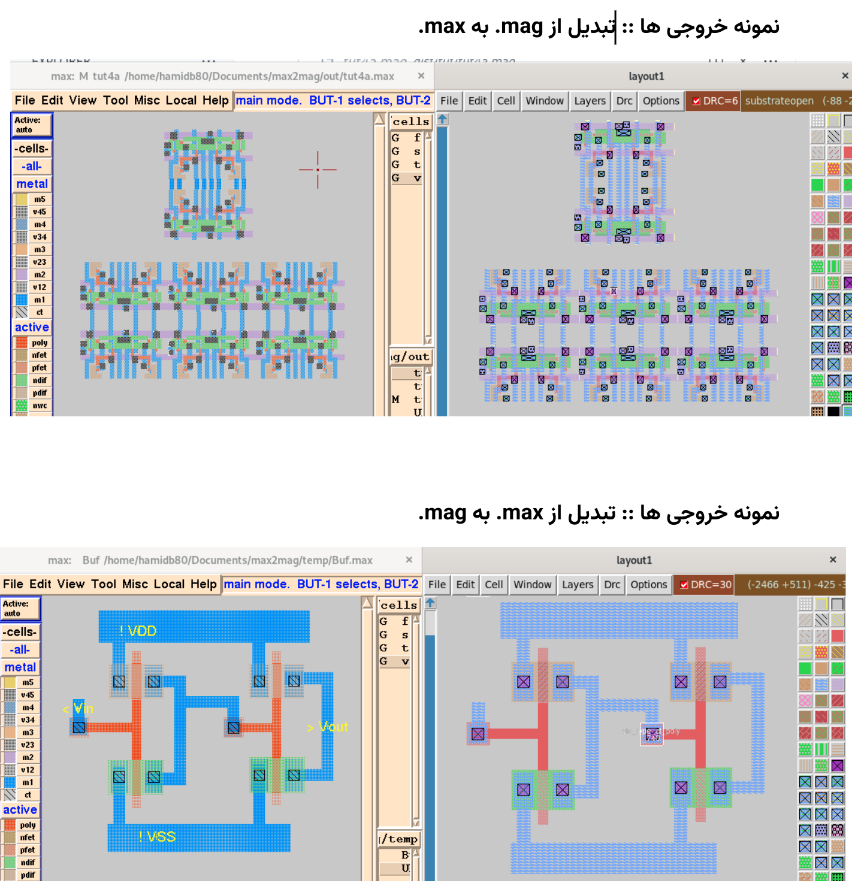

# References
- [Micro Magic Public Domain](https://github.com/yarpose/YARPOSE.Micromagic_PD)
- [Open Circuit Design Magic](https://github.com/RTimothyEdwards/magic)

# Compile
Make sure you have [Nim programming language](https://nim-lang.org/) version 2.0.0, then run:
```bash
nimble gen
```
It will create a binary file in `./bin` folder.

# Help
Run program without any arguments to see the help.

# Demo


# Limitations
- The converted files have DRC (Design Rule Check) errors, but I tested it with different `.tech` files, if you have the same `.tech` file for both softwares, that should work
- I didn't coverted polygon shaped (`Poly`) when converting `.max` to `.mag`, feel free to pull request.

# Report
Read the `report.pdf` file (it is in Persian).

# Why
Because that was my internship
