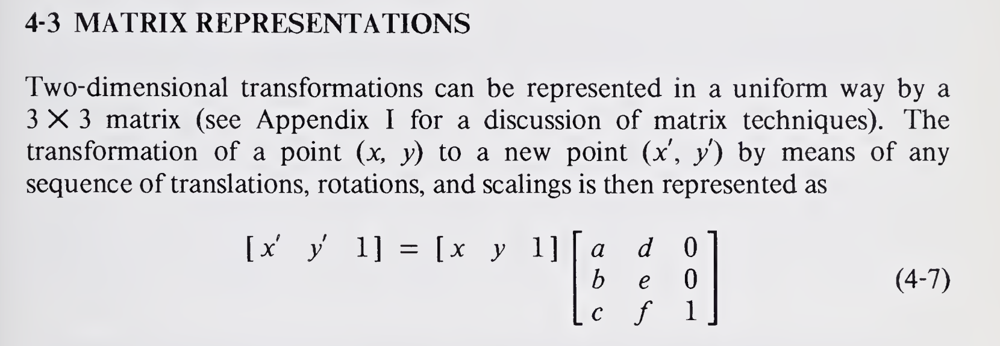
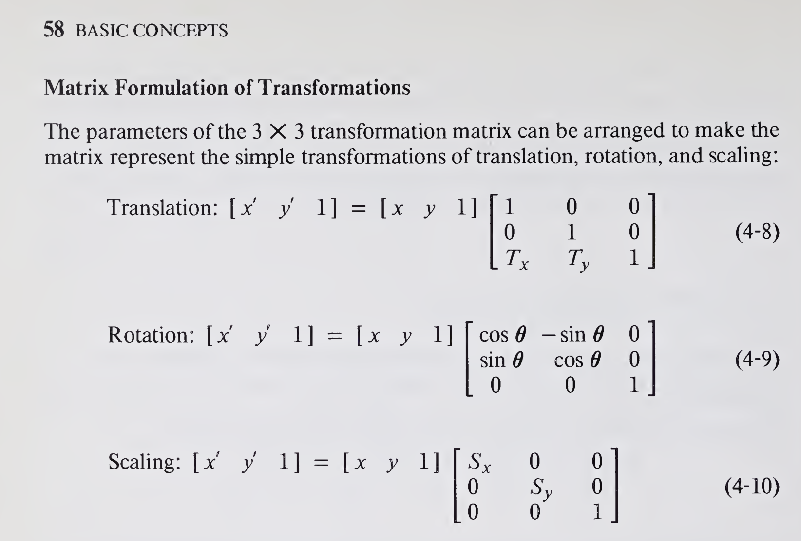

# Max To Mag :: max2mag

## Resources
[_how to download them all?_](https://www.tupp.me/2014/06/how-to-crawl-website-with-linux-wget.html)

```bash
wget --no-parent -k -U mozilla -e robots=off -r URL
```

1. [`.mag` sample files](http://www.ece.sunysb.edu/~psun/ese355/scmoscell/index.htm) 
2. [Magic tutorial](http://opencircuitdesign.com/magic/tutorials/)

## File Syntax Info
### .mag
> .mag files use a scalable imaginary unit called (lambda), 
when converting to other formats or they sent for layout painting, 
the units are converted to something physical

#### commands
```bash
grep -r -h -o --include="*.mag" '^\w\+' | sort -u 
```
```
array
box
magic
rect
rlabel
tech
timestamp
transform
use
```

### .max
```tcl
DEF #fet!-fingers!2!-width!2.0!-_version!1291998914 "fet (S)" "2 X 2.0/0.18"
```

replace `!` with space:
```tcl
DEF #fet -fingers 2 -width 2.0 -_version 1291998914 "fet (S)" "2 X 2.0/0.18"
```

- read about `gcell` in `max_manual/apndxc.html`:


- lab: 
    ```c
    if (sscanf(line, "lab %1023s %d %d %d %d %d %d %99[^\n]",
    layername, &r.r_xbot, &r.r_ybot, &r.r_xtop, &r.r_ytop, &orient, &kind, text) != 8)
	```

    ```c
    DBLabelTypedText(char *text, int kind, char *nameBuf, int bufSize)
    {
        int spaceLeft = bufSize;

        switch(kind)
        {
            case LAB_COMMENT: strcpy(nameBuf,"# " ); spaceLeft -=2; break;
            case LAB_HIDDEN:  strcpy(nameBuf,"H "); spaceLeft -=2; break;
            case LAB_LOCAL:   strcpy(nameBuf,""); break;
            case LAB_GLOBAL:  strcpy(nameBuf,"! "); spaceLeft -=2; break;
            case LAB_INPUT:   strcpy(nameBuf,"< "); spaceLeft -=2; break;
            case LAB_OUTPUT:  strcpy(nameBuf,"> "); spaceLeft -=2; break;
            case LAB_INOUT:   strcpy(nameBuf,"<> "); spaceLeft -=3; break;
            defalut: ASSERT(FALSE,"DBLabelKindName");
        }

        (void) strncat(nameBuf,text,spaceLeft-1);
    }
    ```

- rect:
    ```c
      sprintf(pstring, "%d %d %d %d %s\n",
	      LEFT(tile), BOTTOM(tile), RIGHT(tile), TOP(tile),
    ```

- DEF:
```
  /* no name on DEF line, so main def */
```

```c
p = StrQuoteParse(p, buf);
StrDup(&depDef->cd_showName, buf);
p = StrQuoteParse(p, buf);
StrDup(&depDef->cd_showInst, buf);
```

```c
      sprintf(cstring, "gcell %d %s\n",     
	      def->cd_vMAIN.vs_time,
	      def->cd_name);

- `_` in first:

search `\b_version`

```c
sprintf(nameBuf,"%s!-_version!%d",
    name,
    def->cd_vMAIN.vs_time);
```

- `database.h`
```c 
typedef struct celldef
{
```


crwwwwwn
```c
static bool
dbCellWriteFile(CellDef *cellDef,
                /* Pointer to definition of cell to be written out */
                FILE *f)
/* The FILE to write to */
```

```c
char *StrPropAdd(char *name, char *prop, char *value, char *buf)
{

  sprintf(buf,"%s!%s!%s",
```

> The `sscanf()` function returns the number of fields that were successfully converted and assigned

```c
n = sscanf(
    line,
    "\t%1023s %d %d %d %d %d %d array %d %d %d %d %d %d",
    idRead,
    &t.t_a, &t.t_b, &t.t_c, &t.t_d, &t.t_e, &t.t_f,
    &xlo, &xhi, &xsep, &ylo, &yhi, &ysep);
if(n!= 7 && n!= 13) goto error;

```

 


parts of [mentioned book](https://arato.inf.unideb.hu/fazekas.gabor/oktatas/multimedia/BOOKS/newman_sproul_princ_comp_graph.pdf
)

```c
/*-------------------------------------------------------------------
 * Structure definition for geometrical transformers.  They are
 * stored in the form described by Newman and Sproull on page 57.
 * Magic allows only 90 degree orientations, and normally there
 * is no scaling (scaling only occurs when transforming to pixel
 * coordinates).  Thus the elements a, b, d, and e always have
 * one of the following forms, where S is the scaling factor:
 *
 *  S  0    0 -S    -S  0    0  S    S  0    0  S    -S  0    0 -S
 *  0  S    S  0     0 -S   -S  0    0 -S    S  0     0  S   -S  0
 *
 * The first four forms correspond to clockwise rotations of 0, 90,
 * 180, and 270 degrees, and the second four correspond to the same
 * four orientations flipped upside down (mirror across the x-axis
 * after rotating).
 *-------------------------------------------------------------------
 */
typedef struct
{
    int t_a, t_b, t_c, t_d, t_e, t_f;
} Transform;
```

array
```
	&xlo, &xhi, &xsep, &ylo, &yhi, &ysep
```

# MAX Guide
## Fill
1. select an area
2. right click on a layer in the left toolbar

## Move
- drag middle mouse 
- arrow keys

## Add another Cell
press `Shfit` & drag it from right menu to the cell with `Mouse-1`

## include/subtract metal
1. select an area
2. right click on it
	- inside to include
	- outside to substract

# Template
```rust
# comments ...

max [MAX_VERSION]
tech [TECHNOLOGY]
resolution [SCALE]

// DEF has 2 forms
DEF #[IDENT]!-_version![TIMESTAMP] "[SHOW_NAME]" "[SHOW_INST]" // external components
DEF // main | must be only one in a .max file

SECTION VERIONS {
(vMAIN|vDRC|vBBOX) [TIMESTAMP] [REVISTION]
} SECTION VERIONS

SECTION RECTS {
layer [LAYER]
l b r t // left(x1) bottom(y1) right(x2) top(y2)
} SECTION RECTS

SECTION GROUPS {
} SECTION GROUPS

SECTION LABELS {
lab [LAYER] l b r t orient kind text
} SECTION LABELS

SECTION INSTANCES {
gcell [TIMESTAMP] #[IDENT]
bbox l b r t
uses { 

	USE_IDENT: 
		_[INDEX]
		/#[FORKED_FROM_IDENT]_[USES_INDEX_OF_FORKED]

	 [USE_IDENT] [TRANSFORM] ? array [TRANSFORM]
}
```
## Sections
accroding to `src/max/m/database/dbwrite.c`
- VERSIONS
- RECTS
- LABELS
- INSTANCES
- GROUPS
- POLYGONS
- WIREPATHS
- FLYLINES
- PROPERTIES

## Label kinds
```c
/* Kinds of Labels */
#define LAB_COMMENT 	0
/* hidden labels not normally displayed */
#define LAB_HIDDEN 		1 
#define LAB_LOCAL 		2
#define LAB_GLOBAL 		3
/* ports */
#define LAB_INPUT 		4
#define LAB_OUTPUT 		5
#define LAB_INOUT 		6
#define LAB_MAX_KIND 	6
```

## Align (orient)
```c
#define GEO_CENTER		0
#define GEO_NORTH		1
#define GEO_NORTHEAST	2
#define GEO_EAST     	3
#define GEO_SOUTHEAST	4
#define GEO_SOUTH		5
#define GEO_SOUTHWEST	6
#define GEO_WEST		7
#define GEO_NORTHWEST	8
```

## Transition
take a look at `geometry.c`

## Polygon
circles are stored as large polygons
```rust
SECTION POLYGONS {
poly poly [NUMBER_OF_POINTS] {
	X Y // to be repeated 
	}
} SECTION POLYGONS
```

## WIREPATHS
non straight wire
```rust
SECTION WIREPATHS {
wpath layer 0 400 4 {
	2580 2700
	540 2700
	-1186 5690
	-1940 5255
	}
} SECTION WIREPATHS
```

# MAG
http://opencircuitdesign.com/magic/
Look at:
style: left menu -> sub title
1. Using Magic: Introductory Material or [here](http://opencircuitdesign.com/magic/tutorials/)
2. Documentation: Magic Manual Pages


## Lambda Unit
Magic uses "lambda" units that are dimensionless. When layout data are converted to a CIF or GDS file to send to the foundry for chip fabrication, the lambda units are converted to physical units at a appropriate scale.

## Entities in a cell
In Magic, a circuit layout is a hierarchical collection of cells. Each cell contains (primarily) four things: 
1. colored shapes, called paint, that define the circuit's structure
2. textual labels attached to the paint
3. subcells, which are instances of other cells
4. properties, which are arbitrary key-value pairs attached to the cell definition.

## Tech
http://rfic.eecs.berkeley.edu/~niknejad/doc-05-26-02/techfile.html

lambda:
https://www.eecg.toronto.edu/~jzhu/courses/ece435/magic_tutorial.pdf